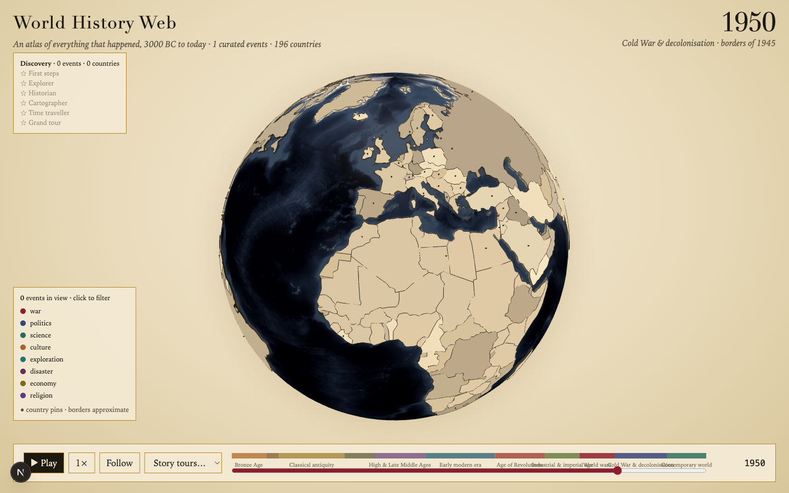

<div align="center">

# 🌍 World History Web

**An interactive 3D atlas of world history, 3000 BC to today, in the browser.**

Drag the timeline and watch borders shift, empires rise and fall, and battles animate across a globe.
Click any pin for the story, with live text and pictures from Wikipedia and Wikimedia Commons.

[**Live demo**](https://whw.vercel.app) · [Quick start](#quick-start) · [Use the globe in your own app](#use-the-globe-in-your-own-app) · [Add history](#add-history) · [Data & licenses](#data--licenses)

[](https://github.com/haakram/WHW/actions/workflows/ci.yml)
[](LICENSE)
[](https://nextjs.org)
[](https://github.com/vasturiano/react-globe.gl)

</div>



## What it does

- **A non-linear timeline** from 3000 BC to 2026. Antiquity moves in 50-year steps, the last 500 years move one year at a time, so the same slider covers Hammurabi and yesterday.
- **Historical borders.** Thirteen snapshots (500 BC, 1 BC, 400, 800, 1279, 1492, 1650, 1815, 1914, 1920, 1945, 1994, 2010) recolour the globe as you scrub. Slide from 1914 to 1920 and the Ottoman Empire becomes Turkey.
- **Every country, pinned.** All current sovereign states come from one Wikidata query: founding year, capital, flag and population. A country's pin only appears once it exists.
- **Curated events with live context.** Hand-written, sourced summaries for the world-shaping moments, plus the live Wikipedia extract and lead image for each one, fetched through a small same-origin proxy. Public-domain newsreels from Wikimedia Commons play inline where they exist.
- **Play mode.** Press play (or the space bar) and history runs forward: pins pulse as events happen, wars draw animated arcs between the belligerents' capitals, borders swap snapshot by snapshot. The camera stays where you left it unless you switch on *Follow*.
- **Story tours.** Guided journeys (WWII, WWI, Rome, the Mongols, the Age of Exploration, the Cold War) fly the camera stop to stop with narration.
- **Discovery badges.** The app remembers, in your browser only, which events, countries and tours you have explored.

No accounts, no database, no API keys. One optional environment variable.

## Quick start

```bash
git clone https://github.com/haakram/WHW.git
cd WHW
pnpm install
pnpm dev          # http://localhost:3000
```

Requirements: Node.js 20+ (24 recommended) and pnpm 10. The generated data (countries, border snapshots, globe textures) is committed, so the app works offline apart from the live Wikipedia panel.

```bash
pnpm data:all     # regenerate countries.json, the border snapshots and textures (network needed)
pnpm test         # unit tests: time scale, ring rewinding, data contracts
pnpm lint:strict  # eslint, 0 warnings allowed
pnpm typecheck    # next typegen + tsc --noEmit
pnpm build        # production build
```

### Deploy

[](https://vercel.com/new/clone?repository-url=https://github.com/haakram/WHW)

Any host that runs Next.js works. Set `WIKI_USER_AGENT` to something that identifies *your* deployment (Wikimedia asks for a contact in the User-Agent and returns 403 without one):

```
WIKI_USER_AGENT="MyHistoryApp/1.0 (https://example.com; me@example.com)"
```

## Use the globe in your own app

The globe is one self-contained client component with a plain props contract. Copy `src/components/globe/` (four files, no app-specific imports beyond the `BorderFeature` type) and render it inside a sized container:

```tsx
import GlobeLoader from "@/components/globe/globe-loader";   // next/dynamic, ssr: false

<div style={{ width: "100%", height: "100vh" }}>
  <GlobeLoader
    polygons={features}                      // GeoJSON Features (Polygon / MultiPolygon)
    polygonColor={(f) => colorFor(f)}        // any CSS colour per polygon
    pins={[{ id: "rome", kind: "event", lat: 41.9, lng: 12.5, color: "#8f1d2c", radius: 0.5, label: "Rome", importance: 5 }]}
    arcs={[{ id: "a", startLat: 52.5, startLng: 13.4, endLat: 51.5, endLng: -0.1, color: ["#8f1d2c", "#d4a73a"] }]}
    rings={[{ id: "r", lat: 41.9, lng: 12.5, color: "#8f1d2c", maxRadius: 6 }]}
    cameraTarget={{ lat: 41.9, lng: 12.5, altitude: 1.2 }}   // change the object to fly there
    autoRotate
    onPinClick={(pin) => console.log(pin.id)}
    onPolygonClick={(feature) => console.log(feature.properties.NAME)}
  />
</div>
```

The full contract is in [`globe-types.ts`](src/components/globe/globe-types.ts). Pieces worth lifting on their own:

| Piece | What it gives you |
|---|---|
| [`src/lib/domain/rewind.ts`](src/lib/domain/rewind.ts) | **The gotcha that costs everyone an afternoon.** three-globe triangulates caps with d3-geo, whose spherical convention is the reverse of RFC 7946. A counter-clockwise exterior ring is read as "the whole sphere except this polygon", so every cap covers the globe. Rewind before you render. |
| [`src/lib/domain/time-scale.ts`](src/lib/domain/time-scale.ts) | Piecewise-linear slider ↔ year mapping with per-era play steps and no year 0. Pure, unit-tested. |
| [`src/app/api/wiki/summary/route.ts`](src/app/api/wiki/summary/route.ts) | A safe proxy for the Wikipedia REST summary API: Zod on the title, fixed upstream host, User-Agent, 8 s timeout, whitelisted response fields, thumbnail host check, cached. |
| [`scripts/fetch-borders.ts`](scripts/fetch-borders.ts) | Downloads historical-basemaps snapshots and simplifies them with mapshaper so they render without a hitch. |
| [`scripts/fetch-countries.ts`](scripts/fetch-countries.ts) | One SPARQL query for every sovereign state with coordinates, flag, capital, founding date and population. |

Things we learned the hard way, so you don't have to:

- Pass explicit `width`/`height` to react-globe.gl; by default it sizes to the window and overlaps your panels.
- `pointsMerge: true` makes points faster but silently disables `onPointClick`.
- The globe must be loaded with `next/dynamic` and `ssr: false` from a client component; WebGL does not exist on the server.
- Wikidata's SPARQL endpoint crashes on `GROUP BY` / `SAMPLE` for this query; dedupe in code. Coordinates come back as WKT `Point(lng lat)`, longitude first.
- Wikimedia thumbnails may be served from `thumb.wikimedia.org`, not only `upload.wikimedia.org`; allow both in your CSP.

## Add history

Events live in [`src/data/events.json`](src/data/events.json) and are validated by the Zod contracts in [`schemas.ts`](src/lib/data/schemas.ts) at load time, so a bad row fails loudly instead of rendering as an empty pin.

```json
{
  "id": "fall-of-constantinople",
  "title": "Fall of Constantinople",
  "year": 1453,
  "lat": 41.01,
  "lng": 28.98,
  "countryIso": "TR",
  "category": "war",
  "importance": 5,
  "summary": "After a 53-day siege, Ottoman forces under Mehmed II breached the Theodosian Walls on 29 May 1453 and took the Byzantine capital, ending the Eastern Roman Empire.",
  "wikipediaTitle": "Fall of Constantinople",
  "belligerents": [
    { "name": "Ottoman Empire", "lat": 40.18, "lng": 29.06, "side": "a" },
    { "name": "Byzantine Empire", "lat": 41.01, "lng": 28.98, "side": "b" }
  ],
  "sources": ["https://en.wikipedia.org/wiki/Fall_of_Constantinople"]
}
```

- Years are integers, negative for BC, and there is no year 0.
- `importance` (1–5) drives pin size, how long an event stays visible after it happens, and which event the *Follow* toggle flies to.
- `belligerents` with two sides make a war draw arcs while the year is inside its span.
- `commonsVideo` takes a Wikimedia Commons file title; `pnpm data:videos` resolves it to a playable URL.
- Tours in [`tours.json`](src/data/tours.json) are ordered lists of event ids with a line of narration each.

Run `pnpm exec tsx scripts/validate-data.ts` after editing; it checks every field and every tour reference.

## Architecture

```
src/app/                  layout, page, global styles, the single API route
src/components/globe/     GlobeCanvas (react-globe.gl), loader, props contract, size hook
src/components/app/       timeline, panels, tour player, legend, badges
src/lib/domain/           pure functions: time scale, eras, snapshot choice, palette, visibility, battles, discovery, rewind
src/lib/data/             Zod schemas, loaders, generated-data paths
src/lib/store/            one reducer + context: year, playing, speed, follow, selection, tour
src/lib/security/         Content-Security-Policy and security headers
src/data/                 curated events, tours, eras (JSON)
public/data/              generated: countries.json, border snapshots (see LICENSE.md there)
scripts/                  data generators and the validator
tests/unit/               vitest
```

Rendering is entirely client-side; the only server code is the Wikipedia proxy. State is one reducer. Every JSON file, curated or generated, is parsed through a Zod schema.

## Security

- Strict Content-Security-Policy: scripts, styles, fonts and XHR are same-origin only; images and media may come from Wikimedia hosts and nowhere else. No third-party scripts or iframes.
- The proxy route only ever calls `en.wikipedia.org`, with a fixed path, a validated title, a timeout, and a whitelisted response shape. No user-supplied URL is ever fetched.
- Generated GeoJSON and JSON are data, never code: parsed through schemas, tooltips are escaped, nothing is rendered as HTML.
- No secrets exist in this project. Discovery progress lives in `localStorage` only.

## Data & licenses

| Data | Source | License |
|---|---|---|
| Historical borders (`public/data/borders/`) | [aourednik/historical-basemaps](https://github.com/aourednik/historical-basemaps), simplified | **GPL-3.0** (data files only, see [notice](public/data/borders/LICENSE.md)) |
| Countries (`public/data/countries.json`) | [Wikidata](https://www.wikidata.org) | CC0 |
| Globe textures (`public/textures/`) | [three-globe](https://github.com/vasturiano/three-globe) examples | MIT |
| Wikipedia summaries and images | fetched live | CC BY-SA 4.0 (text); images carry their own licenses, credited in the panel |
| Commons videos | [Wikimedia Commons](https://commons.wikimedia.org) | per file, credited in the player |
| Curated events and tours (`src/data/`) | this repository | MIT |

The application code is MIT-licensed. Historical boundaries are approximate and disputed; treat them as an illustration, not a reference.

## Roadmap

- Deeper coverage: 5–15 curated events for every country.
- ⌘K search and shareable deep links (year, camera and selection in the URL).
- Layers: trade routes, migrations, day/night terminator.
- Compare two years side by side.
- Mobile layout.

Contributions are welcome; see [CONTRIBUTING.md](CONTRIBUTING.md). Adding well-sourced events is the most valuable thing you can do.

## License

[MIT](LICENSE) for the code. Data files carry the licenses listed above.
